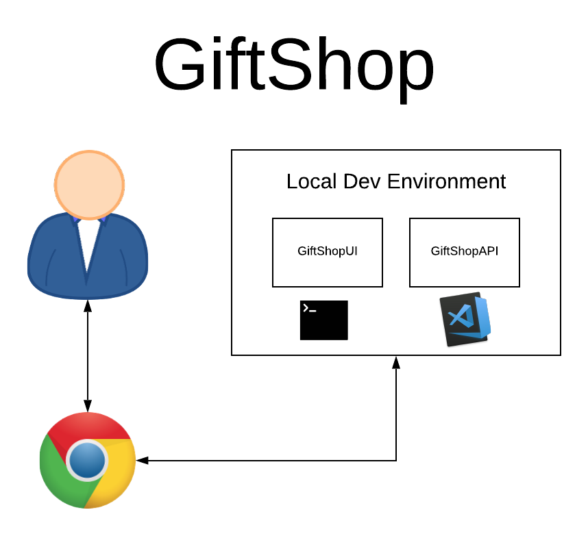
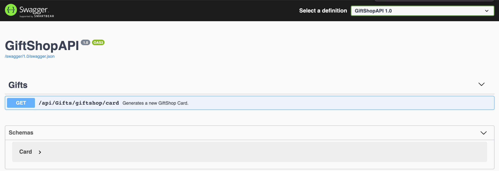
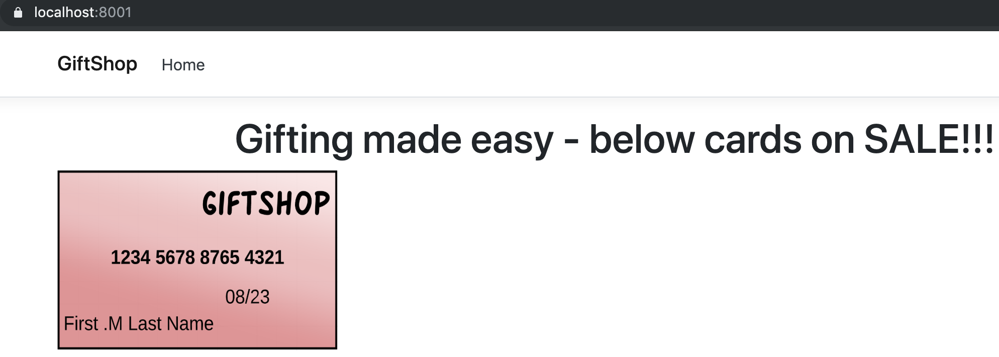
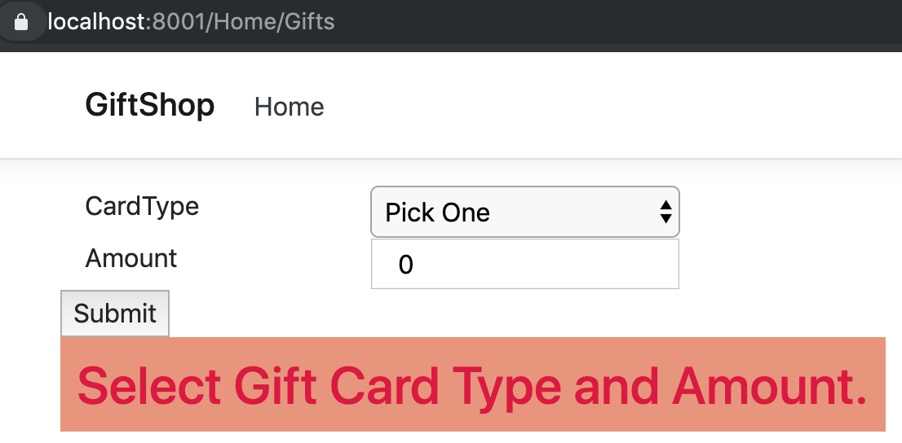
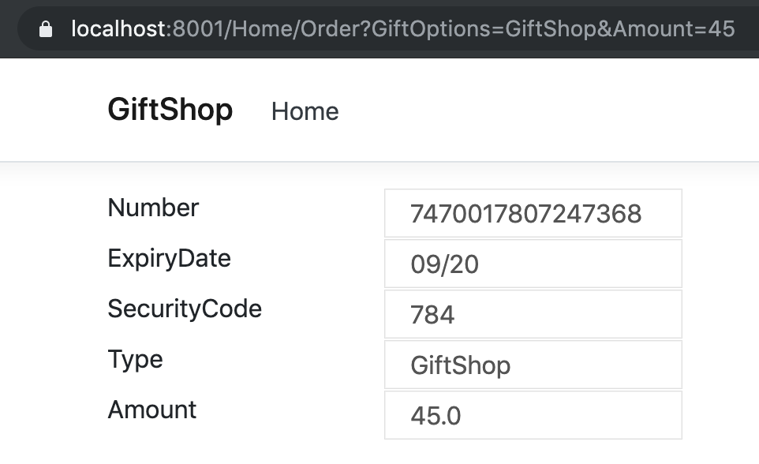

# Lab-01 (Creating a basic GiftShop .Net core Application)



# GiftShop Business Functionality

GiftShop is a fictitious business which makes buying gifts simple. GiftShop has several physical stores across the country. GiftShop sells their own (GiftShop) gift cards online.

Customers may buy GiftShop gift cards online and use it instore to buy things. GiftShop plans to enable online shoping of other GiftShop products and partner gift cards in future depending on customer demand.

# Create GiftShop application using .Net Core

GiftShop is a distributed microservices application which consists of the below parts.

1. GiftShopUI - Provides the required user interface to purchase gifts
2. GiftShopAPI - Provides REST API for the functinality displayed by GiftShopUI
3. CardsOrg - Cards Open standards based shared library for .Net, which exposes basic functionality

## Create the individual microservices

You would find a folder each for each of the above mentioned microservices parts under the _**Begin**_ folder. 

### Pre-requisites

1. This lab uses dotnet core 2.2, which is the recent stable version at the time of the lab creation. You may download dotnet core from  <https://dotnet.microsoft.com/download> .
2. We will be using VSCode as code editor.
3. [git client](https://git-scm.com/book/en/v2/Getting-Started-Installing-Git)
___

### CardsOrg

1. Navigate to the folder ProgNet2019K8sIstio/Lab-01/Begin/CardsOrg in your terminal window from VS Code. As an alternate, you may right click the folder on the left pane in VS Code and choose *Open in Terminal*.
2. Execute `dotnet new classlib` to create a class library project.
3. Delete the default *Class1.cs* created in the project.
4. Add a new class called *Card.cs* with the below contents.

<sub><sup>*Card.cs --> ProgNet2019K8sIstio/Lab-01/Begin/CardsOrg/Card.cs*</sup></sub>
``` c#
using System;

namespace CardsOrg
{
    public class Card
    {
        public string Number { get; set; }
        public string ExpiryDate { get; set; }
        public string SecurityCode { get; set; }
        public string Type { get; set; }
        public double Amount { get; set; }
    }
}
```

This class defines the basic properties required in a gift card and it will be used by most microservices in the lab.

5. We need a class which generates Cards using the class defined above. Create a class called CardGenerator with a public method to obtain a card object.

<sub><sup>*CardGenerator.cs --> ProgNet2019K8sIstio/Lab-01/Begin/CardsOrg/CardGenerator.cs*</sup></sub>
``` c#
using System;

namespace CardsOrg
{
    public class CardGenerator
    {
        /// <summary>
        /// Generates a Random Credit card number with the specified number of digits.
        /// </summary>
        /// <param name="cardNumLen"></param>  
        /// <param name="secCodeLen"></param>  
        public Card GenerateNew(int cardNumLen, int secCodeLen, string type, double amount)
        {
            var expDateTime = DateTime.Now.AddYears(1);
            var newCard = new Card() {
                Number = GetNumber(cardNumLen),
                ExpiryDate =  $"{expDateTime.ToString("MM")}/{expDateTime.ToString("yy")}" ,
                SecurityCode = GetNumber(secCodeLen),
                Type = type,
                Amount = amount
            };

            return newCard;
        }

        private string GetNumber(int noOfDigits)
        {
            string CreditCardNumber = null;
            int nums = noOfDigits;
            Random num = new Random();
            for (int i = 0; i < nums; i++)
            {
            CreditCardNumber = num.Next(9) + CreditCardNumber;
            }

            return CreditCardNumber;
        }
    }
}
```


### GiftShopAPI

1. Navigate to the ProgNet2019K8sIstio/Lab-01/Begin/GiftShopAPI in your terminal window from VS Code. As an alternate, you may right click the folder on the left pane in VS Code and choose *Open in Terminal*.
2. Execute `dotnet new webapi` to create a webapi project.
3. Execute `dotnet run` and navigate to the url https://localhost:5001/api/values to verify if the created default webapi runs as expected. You should see `["value1","value2"]` 
4. Delete the ValuesController.cs file 
5. Add swagger support to the API by following 
    1. Package installation
    2. Add and configure Swagger middleware
    3. XML comments

    sections from <https://docs.microsoft.com/en-us/aspnet/core/tutorials/getting-started-with-swashbuckle?view=aspnetcore-2.2&tabs=visual-studio>
6. Add reference to the CardsOrg project from the GiftShopAPI by executing the below command from VS Code terminal.

``` bash
dotnet add reference ../CardsOrg/CardsOrg.csproj
```

7. Add a new GiftsController in Controllers/GiftsController.cs and expose a GetNewCard Http method, which returns a new GiftShop card.

<sub><sup>*GiftsController.cs --> ProgNet2019K8sIstio/Lab-01/Begin/GiftShopAPI/Controllers/GiftsController.cs*</sup></sub>

``` c#

using Microsoft.AspNetCore.Mvc;
using CardsOrg;
using Microsoft.Extensions.Configuration;

namespace GiftShopAPI.Controllers
{
    [Route("api/[controller]")]
    [ApiController]
    public class GiftsController : ControllerBase
    {
        private IConfiguration _config;

        public GiftsController(
            IConfiguration config)
        {
            _config = config;
        }

        /// <summary>
        /// Generates a new GiftShop Card.
        /// </summary>
        [HttpGet("giftshop/card")]
        public ActionResult<Card> GetGiftShopCard(double amount)
        {
            if(amount > _config.GetValue<double>("App:BusinessSettings:MaxCardAmount"))
                return UnprocessableEntity($"Gift card amount cannot exceed {_config.GetValue<double>("App:BusinessSettings:MaxCardAmount")}");

            return new CardGenerator().GenerateNew(16, 3, "GiftShop", amount);
        }
    }
}
```
8. Add the below section to your appsettings.json. This section is used to hold information about your application.

<sub><sup>*appsettings.json --> ProgNet2019K8sIstio/Lab-01/Begin/GiftShopAPI/appsettings.json*</sup></sub>
``` json
"App": {
    "Title": "GiftShopAPI",
    "Version": "1.0",
    "BusinessSettings": {
        "MaxCardAmount": 200
    }
}
```

9. Use the application infromation from appsettings.json in the swagger configuration code in Startup.cs

<sub><sup>*Startup.cs --> ProgNet2019K8sIstio/Lab-01/Begin/GiftShopAPI/Controllers/Startup.cs*</sup></sub>
``` c#
    public void ConfigureServices(IServiceCollection services)
    {
        services.AddMvc().SetCompatibilityVersion(CompatibilityVersion.Version_2_2);

        // Register the Swagger generator, defining 1 or more Swagger documents
        services.AddSwaggerGen(c =>
        {
            c.SwaggerDoc(Configuration.GetValue<string>("App:Version"), 
                new OpenApiInfo { 
                    Title = Configuration.GetValue<string>("App:Title"), 
                    Version = Configuration.GetValue<string>("App:Version")
                    });

            // Set the comments path for the Swagger JSON and UI.
            var xmlFile = $"{Assembly.GetExecutingAssembly().GetName().Name}.xml";
            var xmlPath = Path.Combine(AppContext.BaseDirectory, xmlFile);
            c.IncludeXmlComments(xmlPath);
        });
    }

    public void Configure(IApplicationBuilder app, IHostingEnvironment env)
    {

        // Enable middleware to serve generated Swagger as a JSON endpoint.
        app.UseSwagger();

        // Enable middleware to serve swagger-ui (HTML, JS, CSS, etc.),
        // specifying the Swagger JSON endpoint.
        app.UseSwaggerUI(c =>
        {
            c.SwaggerEndpoint($"/swagger/{Configuration.GetValue<string>("App:Version")}/swagger.json", 
                $"{Configuration.GetValue<string>("App:Title")} {Configuration.GetValue<string>("App:Version")}");
        });
    }
```
10. Ensure the project runs on port 5000 / 5001 locally by adding the or updating ```GiftShopAPI:applicationUrl``` to ```https://localhost:5001;http://localhost:5000``` in ProgNet2019K8sIstio/Lab-01/Begin/GiftShopAPI/Properties/launchSettings.json
11. Execute ```dotnet run``` to start the application 
12. Navigate to ```https://localhost:5001/swagger/index.html``` in the browser to see the swagger page for GiftShopAPI shown below.



### GiftShopUI

1. Navigate to the ProgNet2019K8sIstio/Lab-01/Begin/GiftShopUI in your terminal window from VS Code. As an alternate, you may right click the folder on the left pane in VS Code and choose *Open in Terminal*.
2. Execute `dotnet new mvc` to create a webapi project.
3. Create a Card model similar to the Card class in the CardsOrg.

<sub><sup>*Card.cs --> ProgNet2019K8sIstio/Lab-01/Begin/GiftShopUI/Models/Card.cs*</sup></sub>
``` c#
namespace GiftShopUI.Models
{
    public class Card
    {
        public string Number { get; set; }
        public string ExpiryDate { get; set; }
        public string SecurityCode { get; set; }
        public string Type { get; set; }
        public string Amount { get; set; }
    }
}
```

*Note: Possible to improve this by Separating CardsOrg proj into CardsOrg.Models and CardsOrg.Service. All APIs can use both CardsOrg.Models and CardsOrg.Service. UI proj can use just the CardsOrg.Models.*

4. Create an enumeration with various Card order options. We would start off with just the GiftShop card option.

<sub><sup>*GiftOptions.cs --> ProgNet2019K8sIstio/Lab-01/Begin/GiftShopUI/Models/GiftOptions.cs*</sup></sub>
``` c#
public enum GiftOptions
{
    GiftShop = 1
}
```

5. Create an Order model which will be used to place an Order for gift card.

<sub><sup>*Order.cs --> ProgNet2019K8sIstio/Lab-01/Begin/GiftShopUI/Models/Order.cs*</sup></sub>
``` c#
using System.ComponentModel.DataAnnotations;

namespace GiftShopUI.Models
{
    public class Order  
    {  
        [Display( Name = "CardType" )]  
        public GiftOptions GiftOptions { get; set; }  

        [Display( Name = "Amount" )]  
        public double Amount { get; set; } 
    
        [Display( Name = "OrderResponse" )]  
        public Card OrderResponse { get; set; }  
    }      
}
```

6. GiftshopUI has to invoke the GiftShopAPI REST API to place user orders. It is accomplished using the *IHttpClientFactory*. Make the below changes for the HTTP calls to work as expected.

<sub><sup>*Startup.cs --> ProgNet2019K8sIstio/Lab-01/Begin/GiftShopUI/Startup.cs*</sup></sub>
``` c#
public class Startup
{
    public void ConfigureServices(IServiceCollection services)
    {
        services.AddHttpClient();
        .....
```

<sub><sup>*HomeController.cs --> ProgNet2019K8sIstio/Lab-01/Begin/GiftShopUI/Controllers/HomeController.cs*</sup></sub>
``` c#
using System.Net.Http;
using Microsoft.Extensions.Configuration;

    public class HomeController : Controller
    {
        private readonly IHttpClientFactory _clientFactory;
        private IConfiguration _config;

        public HomeController(IHttpClientFactory clientFactory,
            IConfiguration config)
        {
            _config = config;
            _clientFactory = clientFactory;
        }
        .....
```

HomeController has the IConfiguration too injected in the constructor to ensure easy configuration if required.

7. Modify the HomeController to accomodate displaying the Gift Card options available for the customer and show a summary of the order placed.

<sub><sup>*HomeController.cs --> ProgNet2019K8sIstio/Lab-01/Begin/GiftShopUI/Controllers/HomeController.cs*</sup></sub>
``` c#
using GiftShopUI.Models;

public IActionResult Gifts(Order model)
{
    if(!model.GiftOptions.Equals("Pick One") && model.Amount > 0)
    {
        return RedirectToAction("Order", model);
    }
    else 
    {
        ViewBag.Result = "Select Gift Card Type and Amount.";
        return View(model);
    }
}

public async Task<IActionResult> Order(Order model)
{
    Card card = null;

    var request = new HttpRequestMessage(HttpMethod.Get, 
                $"{_config.GetValue<string>("ExternalDependencies:GiftShopAPI:BaseUrl")}api/Gifts/{model.GiftOptions.ToString().ToLower()}/card?amount={model.Amount}");
    request.Headers.Add("Accept", "application/json");

    var client = _clientFactory.CreateClient();
    var response = await client.SendAsync(request);

    if (response.IsSuccessStatusCode)
    {
        card = await response.Content
            .ReadAsAsync<Card>();

        model.OrderResponse = card;
    }
    return View(model);
}
```

8. Create the Gifts view which displays the giftcard purchase options to the users.

<sub><sup>*Gifts.cshtml --> ProgNet2019K8sIstio/Lab-01/Begin/GiftShopUI/Views/Home/Gifts.cshtml*</sup></sub>
``` html
@{
    ViewData["Title"] = "Gifts";
}
@model Order  
<form asp-controller="Home" asp-action="Index" method="post" >  
    <div class="form-group">  
        <div class="row">  
            <label asp-for="GiftOptions" class="col-lg-2"></label>  
            <select asp-for="GiftOptions" class="col-lg-2" asp-items="Html.GetEnumSelectList<GiftOptions>()">  
                <option selected="selected" value="0">Pick One</option>  
            </select>  
        </div>  
        <div class="row">  
            <label asp-for="Amount" class="col-lg-2"></label>  
            <input type="double" class="col-lg-2" asp-for="Amount" />  
        </div>  
        <div class="row">  
            <input type="submit" value="Submit" asp-action="Gifts" />  
        </div>  
        <div class="row">  
            <h2 style="color:crimson; background-color:darksalmon; padding:10px;">
                @ViewBag.Result
            </h2>
        </div>  
    </div>  
</form>  
```

9. Create the Order view which displays the giftcard purchased by the user.

<sub><sup>*Order.cshtml --> ProgNet2019K8sIstio/Lab-01/Begin/GiftShopUI/Views/Home/Order.cshtml*</sup></sub>
``` html
@{
    ViewData["Title"] = "Order";
}
@model Order  
<form asp-controller="Home" asp-action="Index" method="post" >  
    <div class="form-group">  
        <div class="row">  
            <label asp-for="OrderResponse.Number" class="col-lg-2"></label>  
            <input type="string" disabled="disabled" class="col-lg-2" asp-for="OrderResponse.Number" />  
        </div>  
        <div class="row">  
            <label asp-for="OrderResponse.ExpiryDate" class="col-lg-2"></label>  
            <input type="string" disabled="disabled" class="col-lg-2" asp-for="OrderResponse.ExpiryDate" />  
        </div>  
        <div class="row">  
            <label asp-for="OrderResponse.SecurityCode" class="col-lg-2"></label>  
            <input type="string" disabled="disabled" class="col-lg-2" asp-for="OrderResponse.SecurityCode" />  
        </div>  
        <div class="row">  
            <label asp-for="OrderResponse.Type" class="col-lg-2"></label>  
            <input type="string" disabled="disabled" class="col-lg-2" asp-for="OrderResponse.Type" />  
        </div>  
            <div class="row">  
            <label asp-for="OrderResponse.Amount" class="col-lg-2"></label>  
            <input type="string" disabled="disabled" class="col-lg-2" asp-for="OrderResponse.Amount" />  
        </div>  
    </div>  
</form>  
```

10. Add the below section to your appsettings.json. This section is used to hold information about External Dependencies.

<sub><sup>*appsettings.json --> ProgNet2019K8sIstio/Lab-01/Begin/GiftShopUI/appsettings.json*</sup></sub>
``` json
"App": {
    "Title": "GiftShopAPI",
    "Version": "1.0"
}
```
11. Copy GiftShop-GiftCard.png from ProgNet2019K8sIstio/Lab-01/Assets to ProgNet2019K8sIstio/Lab-01/Begin/GiftShopUI/wwwroot/images
12. Overwrite the contents in ProgNet2019K8sIstio/Lab-01/Begin/GiftShopUI/Views/Home/Index.cshtml with the below code.

<sub><sup>*Index.cshtml --> ProgNet2019K8sIstio/Lab-01/Begin/GiftShopUI/Views/Home/Index.cshtml*</sup></sub>
``` html
@{
    ViewData["Title"] = "Home Page";
}

<div class="text-center">
    <h1 >Gifting made easy - below cards on SALE!!!</h1>
</div>

<div>
    <div>
        <a href="/Home/Gifts">
            
        </a>
    </div>
</div>
```

13. Ensure the project runs on port 8000 / 8001 locally by adding the or updating ```GiftShopUI:applicationUrl``` to ```https://localhost:8001;http://localhost:8000``` in ProgNet2019K8sIstio/Lab-01/Begin/GiftShopUI/Properties/launchSettings.json
14. Execute ```dotnet run``` to start the application 
15. Navigate to ```https://localhost:8001/``` in the browser to be able to navigate through the pages shown below.

<sub><sup>*Screen 1*</sup></sub>


<sub><sup>*Screen 2*</sup></sub>


<sub><sup>*Screen 3*</sup></sub>


<sub><sup>*Screen 4*</sup></sub>



**Note: If you have successfully completed this Lab, contents in your Begin and End folders would match.**