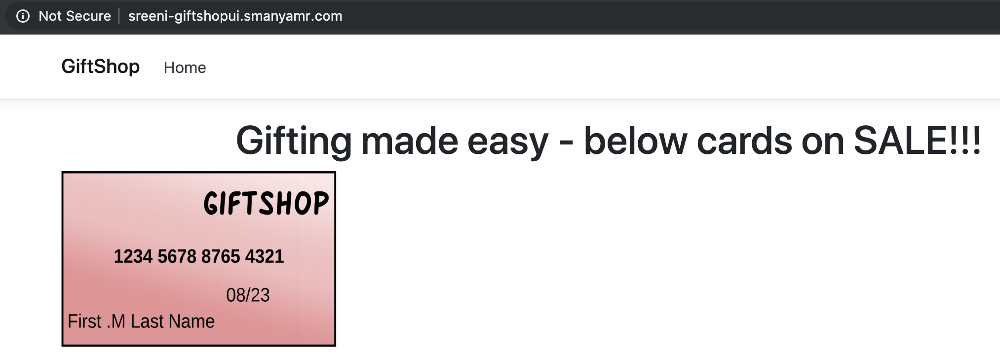
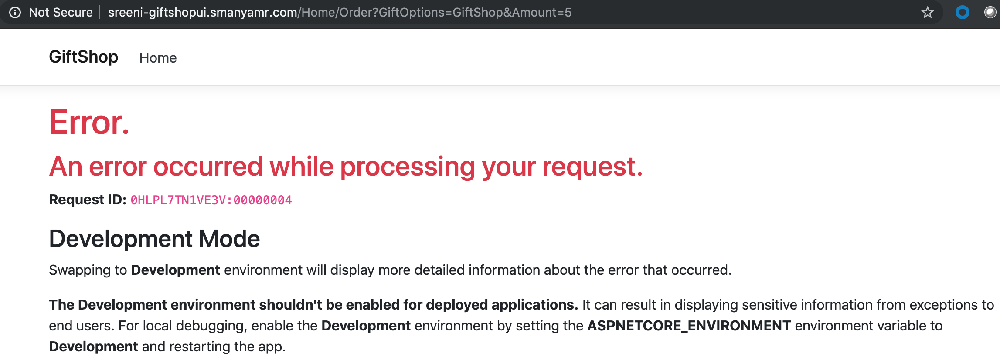
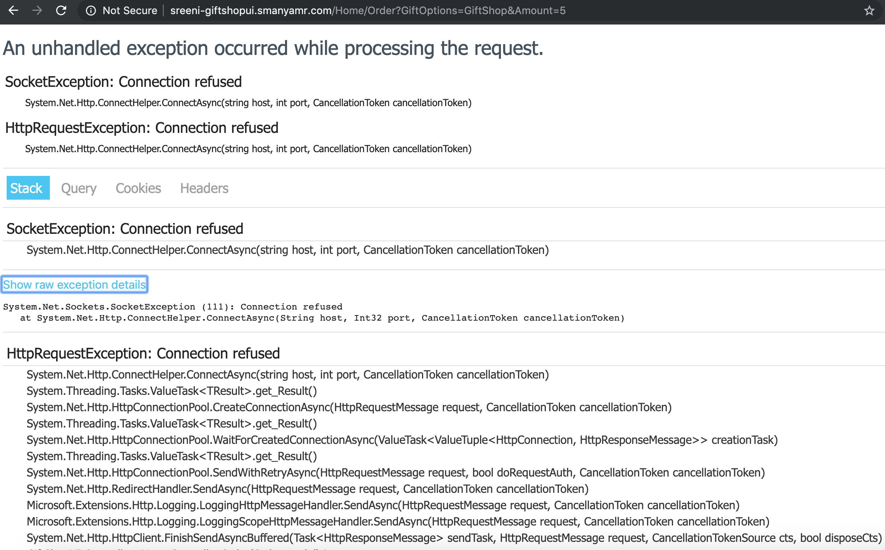

# Lab-07 (Enable Istio and Expose GiftShop on Http)

1. As previously mentioned in the Lab-05, istio should be explicitly enabled at K8s namespace level, for the services in the K8s namespace to leverage istio functionality. Execute the below command to enable istio on your namespace

``` bash
kubectl label namespace <username>-ns istio-injection=enabled
```

2. After enabling Istio, redeploy the GiftShopAPI and GiftShopUI microservices to your <username>-ns namespace. Navigate to ProgNet2019K8sIstio/Lab-07/K8s-Manifests folder and execute the below commads to redeploy the services

``` bash
kubectl apply -f GiftShopAPI.yaml -n <username>-ns
kubectl apply -f GiftShopUI.yaml -n <username>-ns
```

Now if you query the pods in your <username>-ns using the below command, you should see 2/2 against both the giftshopapi and giftshopui pods

``` bash
kubectl get pods -n <username>-ns | grep 'giftshop'

giftshopapi-v1-6dd4854b7d-htmmz   2/2     Running   0          26h
giftshopui-v1-6dd4854b7d-v5wbp   2/2     Running   0          24s
```

This confirms that the automatic sidecar injection is working as expected.

<todo> 
    Just redeploying might not work as there would be no change in the manifest. Explore these options
    a. find out if there is a way to force redeploy on kubernetes... 
    else
    b. try changing the replica count and deploying... this ideally should get us to 2/2 pod state due to a redeploy
    else propose one of the below mentioned strategies
    a. delete and deploy
    b. create a different namespace, enable istio on the new namespace, then deploy k8s, istio manifests and delete old namespace </todo>

3. Though you have the envoy sidecars injected, the service may not be externally accessible yet as GiftShopAPI and GiftShopUI K8s Service manifests still have the ```type: LoadBalancer``` commented out. If you are leveraging Istio, you are expected to leave this setting commented out as all the traffic to the cluster should go through the Istio Service Mesh gateways only.

4. As part of the Istio setup, we provided some information about how Istio leverages K8s CRDs, to expose Istio functionality. In order to get GiftShop application working, we will have to create Gateways and VirtualServices, which were defined as CRDs in the Istio installation.

You may find the Gateway and VirtualService for GiftShopAPI and GiftShopUI defined in the GiftShop-Ingress-Http.yaml.

<sub><sup>*GiftShop-Ingress-Http.yaml --> ProgNet2019K8sIstio/Lab-07/Istio-Manifests/GiftShop-Ingress-Http.yaml*</sup></sub>

``` yaml
apiVersion: networking.istio.io/v1alpha3
kind: Gateway
metadata:
  name: demo-ingress-gateway
spec:
  selector:
    istio: ingressgateway # use istio default controller
  servers:
  - port:
      number: 80
      name: http
      protocol: HTTP
    hosts:
    - <username>-giftshopapi.<username's domain>
    - <username>-giftshopui.<username's domain>
---
apiVersion: networking.istio.io/v1alpha3
kind: VirtualService
metadata:
  name: <username>-giftshopapi
spec:
  hosts:
  - <username>-giftshopapi.<username's domain>
  gateways:
  - demo-ingress-gateway
  http:
  - match:
    - uri:
        prefix: /swagger
    - uri:
        prefix: /api
    route:
    - destination:
        host: giftshopapi
        port:
          number: 80
---
apiVersion: networking.istio.io/v1alpha3
kind: VirtualService
metadata:
  name: <username>-giftshopui
spec:
  hosts:
  - <username>-giftshopui.<username's domain>
  gateways:
  - demo-ingress-gateway
  http:
  - route:
    - destination:
        host: giftshopui
        port:
          number: 80
```
<todo> Add giftshopui to the above manifest </todo>

Deploy the GiftShop-Ingress-Http.yaml to <username>-ns by executing the below command from ProgNet2019K8sIstio/Lab-07/Istio-Manifests folder.

``` bash
kubectl apply -f GiftShop-Ingress-Http.yaml -n <username>-ns
```

5. Create an "A" record in your domain for <username>-giftshopapi, pointing to the internet exposed DNAT ip mapped to the External IP address of Istio ingress.

6. Create an "A" record in your domain for <username>-giftshopui, pointing to the internet exposed DNAT ip mapped to the External IP address of Istio ingress.

7. Now navigate to <username>-giftshopapi.<username's domain>/swagger and <username>-giftshopui.<username's domain> in a browser to see the GiftShop application Home page show up as shown below.



Click on the GiftShop GiftCard image to navigate to the Gifts page shown below.


8. If you select the card and amount in the Gifts page and submit, you would see the error shown in the below picture. 



This is expected at this point in time, as the GiftShopUI appsettings.json still has local url for GiftShopAPI. If you want to see more details about the error, you may add the below settings to the K8s manifest (GiftShopUI.yaml),just below container port settings.

``` yaml
        env:
        - name: ASPNETCORE_ENVIRONMENT
          value: "Development"
```

Then you would see more detailed exception shown below.



``` json
  "ExternalDependencies": {
    "GiftShopAPI": {
      "BaseUrl": "http://localhost:5000/"
    }
  }
```

This has to be changed to a discoverable endpoint in the Istio Service Mesh.

9. We will fix this in the next lab by means of Service Discovery.