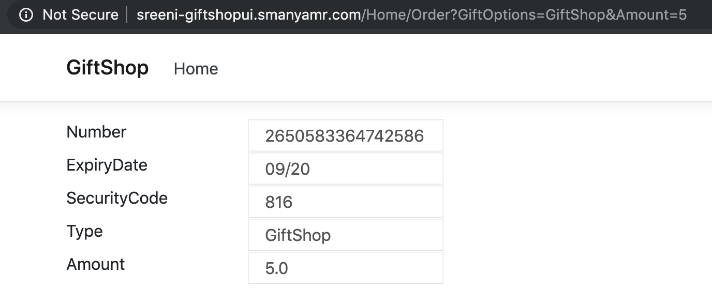

# Lab-08 (Service Discovery using Istio)

1. Now that we have several items such as source code, K8s manifests and Istio manifests to handle, lets group them for better maintenance.
2. Create a Folder Strucutre as below.
```
    Lab-08
        GiftShop
            Src
            K8s-Manifests
            Istio-Manifests
```
3. Copy over the appropriate content from previous labs into Lab-08, so that this becomes a reference base henceforth.
    1. Copy over all contents from Lab-02/End into Lab-08/GiftShop/Src
    2. Copy over all contents from Lab-07/K8s-Manifests into Lab-08/GiftShop/K8s-Manifests
    3. Copy over all contents from Lab-07/Istio-Manifests into Lab-08/GiftShop/Istio-Manifests
4. Change the value of ```BaseUrl``` in the GiftShopUI appsettings.json to ```http://giftshopapi.<username>-ns.svc.cluster.local/```
Where ```giftshopapi``` is the service name given to GiftShopAPI in K8s manifest.
5. Rebuild the GiftShopUI image by executing the below command from ProgNet2019K8sIstio/Lab-08/GiftShop/Src

``` bash
docker build -f Dockerfile.GiftShopUI -t <username>-giftshopui:2.0 .
```
6. Tag the image using the command

``` bash 
docker tag <username>-giftshopui:2.0 <YOUR_HARBOR_FQDN>/<YOUR_HARBOR_PROJECT>/<username>-giftshopapi:2.0
```
7. If you are logged out of Harbor, login and then Push the image to Harbor using

``` bash
docker push <YOUR_HARBOR_FQDN>/<YOUR_HARBOR_PROJECT>/<username>-giftshopui:2.0
```
8. Change the version of giftshopui image in ProgNet2019K8sIstio/Lab-08/GiftShop/K8s-Manifests/GiftShopUI.yaml to 2.0 and apply changes to K8s using 

``` bash
kubectl apply -f GiftShopUI.yaml -n <username>-ns
```
9. Now navigating from Gifts Page 


to Order Page should work without errors and display the below screen.


