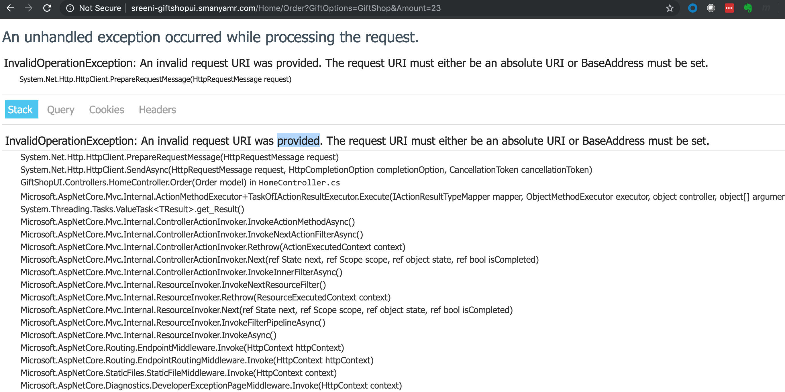

# Lab-09 (Externalize Config using ConfigMaps)

Configuration should live outside the deployable code, if your code and configuration should evolve with least friction. There are few ways in which we can externalize the config. In this lab, we will explore the way in which we can externalize the config and briefly discuss about recommendations. In Kubernetes configuration is managed using ConfigMaps.

Copy all the folders from ProgNet2019K8sIstio/Lab-08 to ProgNet2019K8sIstio/Lab-09

## Configure using Container Env variables and ConfigMaps

In this section, we will store the configuration in the ConfigMaps and pass it to the service using the container environment variables.

### Create a ConfigMap 

1. Navigate to ProgNet2019K8sIstio/Lab-09/GiftShop/K8s-Manifests
2. Create a new file called GiftShopUI-ConfigEnv.yaml and paste the below contents.

``` yaml
apiVersion: v1
kind: ConfigMap
metadata:
  name: giftshopui-config
data:
  GiftShopAPIBaseUrl: http://giftshopapi.<username>-microservices.svc.cluster.local/
```
3. Deploy the ConfigMap to the K8s environment by executing 

``` bash
kubectl apply -f GiftShopUI-ConfigEnv.yaml -n <username>-ns
```

### Remove GiftShopAPI BaseUrl from Appsettings.

1. Open the GiftShopUI appsettings from ProgNet2019K8sIstio/Lab-09/GiftShop/Src/GiftShopUI/appsettings.json
2. Remove the below settings

``` json
  "ExternalDependencies": {
    "GiftShopAPI": {
      "BaseUrl": "http://giftshopapi.<username>-microservices.svc.cluster.local/"
    }
  },
```

### Create container and push

1. Navigate to ProgNet2019K8sIstio/Lab-09/GiftShop/Src
2. Execute the below command to build the docker image locally

``` bash
docker build -f Dockerfile.GiftShopUI -t <username>-giftshopui:3.0 .
```
3. Tag the image using

``` bash
docker tag <username>-giftshopui:3.0 <YOUR_HARBOR_FQDN>/<YOUR_HARBOR_PROJECT>/<username>-giftshopui:3.0
```
4. Push the image to harbor using

``` bash
docker push <YOUR_HARBOR_FQDN>/<YOUR_HARBOR_PROJECT>/<username>-giftshopapi:3.0
```

### Update the GiftShopUI K8s manifest and redeploy

1. Open the GiftShopUI K8s manifest from ProgNet2019K8sIstio/Lab-09/GiftShop/K8s-Manifests/GiftShopUI.yaml
2. Add the configmap related env settings to env section as shown below.

``` yaml
        - name: ExternalDependencies_GiftShopAPI_BaseUrl
          valueFrom:
            configMapKeyRef:
              name: giftshopui-config
              key: GiftShopAPIBaseUrl
```

```
Note: K8s yaml does not allow you to set the name to "ExternalDependencies:GiftShopAPI:BaseUrl" as it validates against the RegEx ([-._a-zA-Z][-._a-zA-Z0-9]*). 
So you are forced to change the name to "ExternalDependencies_GiftShopAPI_BaseUrl"
This limitation will break your existing UI code as it reads the config using flattened structure "ExternalDependencies:GiftShopAPI:BaseUrl". 
We will see a fix before the end of this lab.
```

3. Update the version of the image and the deployment to 3.0 as shown below.

``` yaml
apiVersion: apps/v1beta1
kind: Deployment
metadata:
  name: giftshopui-v3
spec:
  replicas: 1
  template:
    metadata:
      labels:
        app: giftshopui
        tier: frontend
        version: v3
    spec:
      containers:
      - name: giftshopui
        image: <YOUR_HARBOR_FQDN>/<YOUR_HARBOR_PROJECT>/<username>-giftshopui:3.0
        imagePullPolicy: Always
```

4. Apply the deployment changes by using the command

``` bash
kubectl apply -f GiftShopUI.yaml -n <username>-ns
```

5. Now if you purchase the Gift from Gifts Page, you would see the below error.



That is because, your code is still reading from the setting "ExternalDependencies:GiftShopAPI:BaseUrl". To fix this issue, you may follow the remaining steps in this section.

6. Open the HomeController and replace "ExternalDependencies:GiftShopAPI:BaseUrl" with "ExternalDependencies_GiftShopAPI_BaseUrl"

7. Build a docker image for the GiftShopUI using 

``` bash
docker build -f Dockerfile.GiftShopUI -t <username>-giftshopui:4.0 .
```

8. Tag the docker image version 4.0 of GiftShopUI using 

``` bash
docker tag <username>-giftshopui:4.0 <YOUR_HARBOR_FQDN>/<YOUR_HARBOR_PROJECT>/<username>-giftshopui:4.0
```

9. Push the image to Harbor using

``` bash
docker push <YOUR_HARBOR_FQDN>/<YOUR_HARBOR_PROJECT>/<username>-giftshopapi:4.0
```

10. Update the version of the image and the deployment to 4.0 as shown below.

``` yaml
apiVersion: apps/v1beta1
kind: Deployment
metadata:
  name: giftshopui-v4
spec:
  replicas: 1
  template:
    metadata:
      labels:
        app: giftshopui
        tier: frontend
        version: v4
    spec:
      containers:
      - name: giftshopui
        image: <YOUR_HARBOR_FQDN>/<YOUR_HARBOR_PROJECT>/<username>-giftshopui:4.0
        imagePullPolicy: Always
```

11. Apply the deployment changes by using the command

``` bash
kubectl apply -f GiftShopUI.yaml -n <username>-ns
```

12. Now the GiftShopUI will work as expected and you would not see any errors in ordering.

### Cons of this approach

1. This way of using the ConfigMap does not work with dotnet core applications using flattened configuration.
2. Any updates to the values in the ConfigMap does not automatically get passed to the application. It requires the container to be recreated to reflect the change in config value.

## Configure using volumes and ConfigMaps

### Update the ConfigMap 

1. Navigate to ProgNet2019K8sIstio/Lab-09/GiftShop/K8s-Manifests
2. Create a new file called GiftShopUI-ConfigVolume.yaml and paste the below contents.

``` yaml
apiVersion: v1
kind: ConfigMap
metadata:
  name: giftshopui-config
data:
  GiftShopAPIBaseUrl: |-
    {
      "ExternalDependencies": {
        "GiftShopAPI": {
          "BaseUrl": "http://giftshopapi.<username>-ns.svc.cluster.local/"
        }
      }
    }
```

3. Deploy the ConfigMap to the K8s environment by executing 

``` bash
kubectl apply -f GiftShopUI-ConfigVolume.yaml -n <username>-ns
```

### Create container and push

1. Open the HomeController and replace "ExternalDependencies_GiftShopAPI_BaseUrl" with "ExternalDependencies:GiftShopAPI:BaseUrl"
2. Update CreateWebHostBuilder in the Program.cs as shown below

``` c#
        public static IWebHostBuilder CreateWebHostBuilder(string[] args) =>
            WebHost.CreateDefaultBuilder(args)
                .ConfigureAppConfiguration((hostingContext, config) =>
                {
                    config
                    .AddJsonFile("/app/appsettings.json", optional: false, reloadOnChange: true)
                    .AddJsonFile("/app/AppConfig.json", optional: false, reloadOnChange: true)
                    .AddEnvironmentVariables();
                })
                .UseStartup<Startup>();
    }
```

3. Execute the below command to build the docker image locally

``` bash
docker build -f Dockerfile.GiftShopUI -t <username>-giftshopui:5.0 .
```
4. Tag the image using

``` bash
docker tag <username>-giftshopui:5.0 <YOUR_HARBOR_FQDN>/<YOUR_HARBOR_PROJECT>/<username>-giftshopui:5.0
```
5. Push the image to harbor using

``` bash
docker push <YOUR_HARBOR_FQDN>/<YOUR_HARBOR_PROJECT>/<username>-giftshopapi:5.0
```

### Update the GiftShopUI K8s manifest and redeploy

1. Open the GiftShopUI K8s manifest from ProgNet2019K8sIstio/Lab-09/GiftShop/K8s-Manifests/GiftShopUI.yaml
2. Comment out the env section with ConfigMap as shown below

``` yaml
        # - name: ExternalDependencies_GiftShopAPI_BaseUrl
        #   valueFrom:
        #     configMapKeyRef:
        #       name: giftshopui-config
        #       key: GiftShopAPIBaseUrl
```
3. Add the VolumeMount and Volumes as shown below

``` yaml
        volumeMounts:
        - name: giftshopui-config
          mountPath: /app/AppConfig.json
          subPath: AppConfig.json
        imagePullSecrets:
        - name:  <username>harborsecret
      volumes:
      - name: giftshopui-config
        configMap:
            name: giftshopui-config
```

4. Apply the deployment changes by using the command

``` bash
kubectl apply -f GiftShopUI.yaml -n <username>-ns
```

### Troubleshooting

1. At this point your pod would not start and will fail as below.

``` bash
kubectl get pods -n <username>-ns
NAME                              READY   STATUS             RESTARTS   AGE
giftshopapi-v1-6dd4854b7d-7l7cz   2/2     Running            0          29h
giftshopui-v5-c7d5b6fff-96mh2     1/2     CrashLoopBackOff   1          16s
```

You may want to see the reason for failure. You may do so by looking into the logs for the *giftshopui* container inside the *giftshopui-v5-c7d5b6fff-96mh2* pod, by executing the below command.

``` bash
kubectl logs -f -c giftshopui giftshopui-v5-c7d5b6fff-96mh2 -n <username>-ns

Unhandled Exception: System.IO.FileNotFoundException: The configuration file 'AppConfig.json' was not found and is not optional. The physical path is '/app/AppConfig.json'.
   at Microsoft.Extensions.Configuration.FileConfigurationProvider.Load(Boolean reload)
   at Microsoft.Extensions.Configuration.FileConfigurationProvider.Load()
   at Microsoft.Extensions.Configuration.ConfigurationRoot..ctor(IList`1 providers)
   at Microsoft.Extensions.Configuration.ConfigurationBuilder.Build()
   at Microsoft.AspNetCore.Hosting.WebHostBuilder.BuildCommonServices(AggregateException& hostingStartupErrors)
   at Microsoft.AspNetCore.Hosting.WebHostBuilder.Build()
   at GiftShopUI.Program.Main(String[] args) in /app/GiftShopUI/Program.cs:line 17
```

To get into the running container and execute bash commands, use the below command.

``` bash
kubectl exec -t -i -c giftshopui giftshopui-v5-85fc86cdc-26bg9 -n <username>-microservices  bash

root@giftshopui-v5-85fc86cdc-26bg9:/app# ls
GiftShopUI	      GiftShopUI.Views.pdb  GiftShopUI.dll  GiftShopUI.runtimeconfig.json  appsettings.json  wwwroot
GiftShopUI.Views.dll  GiftShopUI.deps.json  GiftShopUI.pdb  appsettings.Development.json   web.config

root@giftshopui-v5-85fc86cdc-26bg9:/app# pwd
/app
```

### Pros of this approach

1. Using volumes is very straight forward and lets your .Net code use files based config. This ensure we are not introducing any platform dependency in the .NEt code.
2. I prefer not to use Kubeclient based nuget as it ties my K8s. I want my code to remain platform agonistic.

