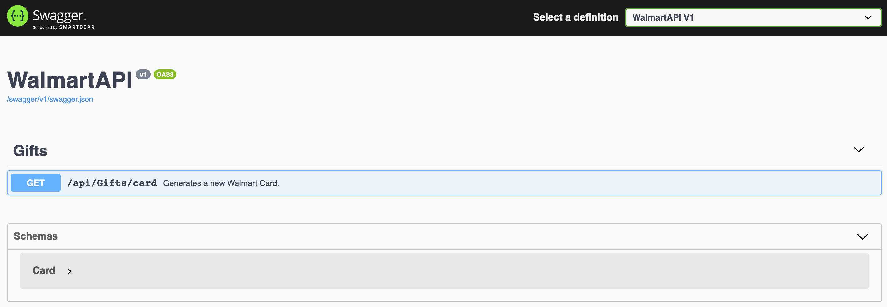
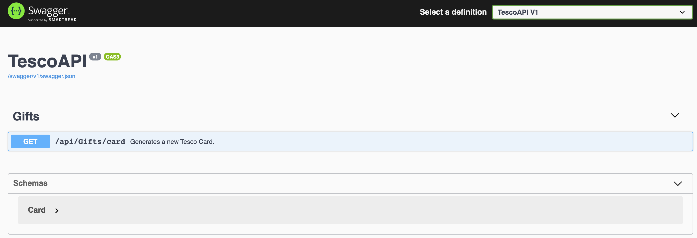

#   Lab-11 (Create 3rd party API and deploy to Azure)

### Pre-requisites

Copy the CardsOrg code from ProgNet2019K8sIstio/Lab-01/End/CardsOrg to ProgNet2019K8sIstio/Lab-11/Begin

## Create Walmart GiftCard API

1. Navigate to the ProgNet2019K8sIstio/Lab-11/Begin/WalmartAPI in your terminal window from VS Code. As an alternate, you may right click the folder on the left pane in VS Code and choose *Open in Terminal*.
2. Execute `dotnet new webapi` to create a webapi project.
3. Execute `dotnet run` and navigate to the url https://localhost:5001/api/values to verify if the created default webapi runs as expected. You should see `["value1","value2"]` 
4. Delete the ValuesController.cs file 
5. Add swagger support to the API by following 
    1. Package installation
    2. Add and configure Swagger middleware
    3. XML comments

    sections from <https://docs.microsoft.com/en-us/aspnet/core/tutorials/getting-started-with-swashbuckle?view=aspnetcore-2.2&tabs=visual-studio>
6. Add reference to the CardsOrg project from the GiftShopAPI by executing the below command from VS Code terminal.

``` bash
dotnet add reference ../CardsOrg/CardsOrg.csproj
```

7. Add a new GiftsController in Controllers/GiftsController.cs and expose a GetCard Http method, which returns a new Tesco card.

<sub><sup>*GiftsController.cs --> ProgNet2019K8sIstio/Lab-11/Begin/WalmartAPI/Controllers/GiftsController.cs*</sup></sub>

``` c#
using Microsoft.AspNetCore.Mvc;

using CardsOrg;
using System.Collections.Generic;
using Microsoft.Extensions.Primitives;

namespace WalmartAPI.Controllers
{
    [Route("api/[controller]")]
    [ApiController]
    public class GiftsController : ControllerBase
    {
        /// <summary>
        /// Generates a new Walmart Card.
        /// </summary>
        [HttpGet("card")]
        public ActionResult<Card> GetCard(double amount)
        {
            if (!Request.Headers.Contains(new KeyValuePair<string, StringValues>("X-API-KEY", "GiftShopClient")))
            {
                return BadRequest("You must supply an API key header called X-API-KEY");
            }
            return new CardGenerator().GenerateNew(16, 3, "Walmart", amount);
        }
    }
}
```
8. Change the Title to WalmartAPI in the Startup.ConfigureServices as shown below.

<sub><sup>*Startup.cs --> ProgNet2019K8sIstio/Lab-11/Begin/WalmartAPI/Startup.cs*</sup></sub>
``` c#
                c.SwaggerDoc("v1", new OpenApiInfo { Title = "WalmartAPI", Version = "v1" });
```

9. Change the SwaggerEndpoint as below in the Startup.cs

<sub><sup>*Startup.cs --> ProgNet2019K8sIstio/Lab-11/Begin/WalmartAPI/Startup.cs*</sup></sub>
``` c#
                c.SwaggerEndpoint("/swagger/v1/swagger.json", "WalmartAPI V1");
```

10. Ensure the project runs on port 6000 / 6001 locally by adding the or updating ```WalmartAPI:applicationUrl``` to ```https://localhost:6001;http://localhost:6000``` in ProgNet2019K8sIstio/Lab-11/Begin/WalmartAPI/Properties/launchSettings.json
11. Execute ```dotnet run``` to start the application 
12. Navigate to ```https://localhost:6001/swagger/index.html``` in the browser to see the swagger page for GiftShopAPI shown below.




## Create Tesco GiftCard API

1. Navigate to the ProgNet2019K8sIstio/Lab-11/Begin/TescoAPI in your terminal window from VS Code. As an alternate, you may right click the folder on the left pane in VS Code and choose *Open in Terminal*.
2. Execute `dotnet new webapi` to create a webapi project.
3. Execute `dotnet run` and navigate to the url https://localhost:5001/api/values to verify if the created default webapi runs as expected. You should see `["value1","value2"]` 
4. Delete the ValuesController.cs file 
5. Add swagger support to the API by following 
    1. Package installation
    2. Add and configure Swagger middleware
    3. XML comments

    sections from <https://docs.microsoft.com/en-us/aspnet/core/tutorials/getting-started-with-swashbuckle?view=aspnetcore-2.2&tabs=visual-studio>
6. Add reference to the CardsOrg project from the GiftShopAPI by executing the below command from VS Code terminal.

``` bash
dotnet add reference ../CardsOrg/CardsOrg.csproj
```

7. Add a new GiftsController in Controllers/GiftsController.cs and expose a GetCard Http method, which returns a new Tesco card.

<sub><sup>*GiftsController.cs --> ProgNet2019K8sIstio/Lab-11/Begin/TescoAPI/Controllers/GiftsController.cs*</sup></sub>

``` c#
using Microsoft.AspNetCore.Mvc;

using CardsOrg;
using System.Collections.Generic;
using Microsoft.Extensions.Primitives;

namespace TescoAPI.Controllers
{
    [Route("api/[controller]")]
    [ApiController]
    public class GiftsController : ControllerBase
    {
        /// <summary>
        /// Generates a new Tesco Card.
        /// </summary>
        [HttpGet("card")]
        public ActionResult<Card> GetCard(double amount)
        {
            if (!Request.Headers.Contains(new KeyValuePair<string, StringValues>("X-API-KEY", "GiftShopClient")))
            {
                return BadRequest("You must supply an API key header called X-API-KEY");
            }
            return new CardGenerator().GenerateNew(16, 3, "Tesco", amount);
        }
    }
}
```
8. Change the Title to TescoAPI in the Startup.ConfigureServices as shown below.

<sub><sup>*Startup.cs --> ProgNet2019K8sIstio/Lab-11/Begin/TescoAPI/Startup.cs*</sup></sub>
``` c#
                c.SwaggerDoc("v1", new OpenApiInfo { Title = "TescoAPI", Version = "v1" });
```

9. Change the SwaggerEndpoint as below in the Startup.cs

<sub><sup>*Startup.cs --> ProgNet2019K8sIstio/Lab-11/Begin/TescoAPI/Startup.cs*</sup></sub>
``` c#
                c.SwaggerEndpoint("/swagger/v1/swagger.json", "TescoAPI V1");
```

10. Ensure the project runs on port 7000 / 7001 locally by adding the or updating ```TescoAPI:applicationUrl``` to ```https://localhost:7001;http://localhost:7000``` in ProgNet2019K8sIstio/Lab-11/Begin/TescoAPI/Properties/launchSettings.json
11. Execute ```dotnet run``` to start the application 
12. Navigate to ```https://localhost:7001/swagger/index.html``` in the browser to see the swagger page for GiftShopAPI shown below.




## Deploy the Walmart and Tesco APIs

1. You may deploy the Walmart and Tesco APIs outside of this K8s cluster. The Walmart and Tesco APIs should be available for consumption from the GiftShopAPI.

**Note: If you have successfully completed this Lab, contents in your Begin and End folders would match.**