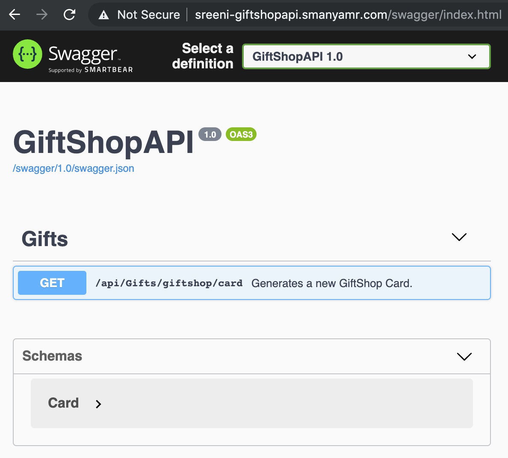
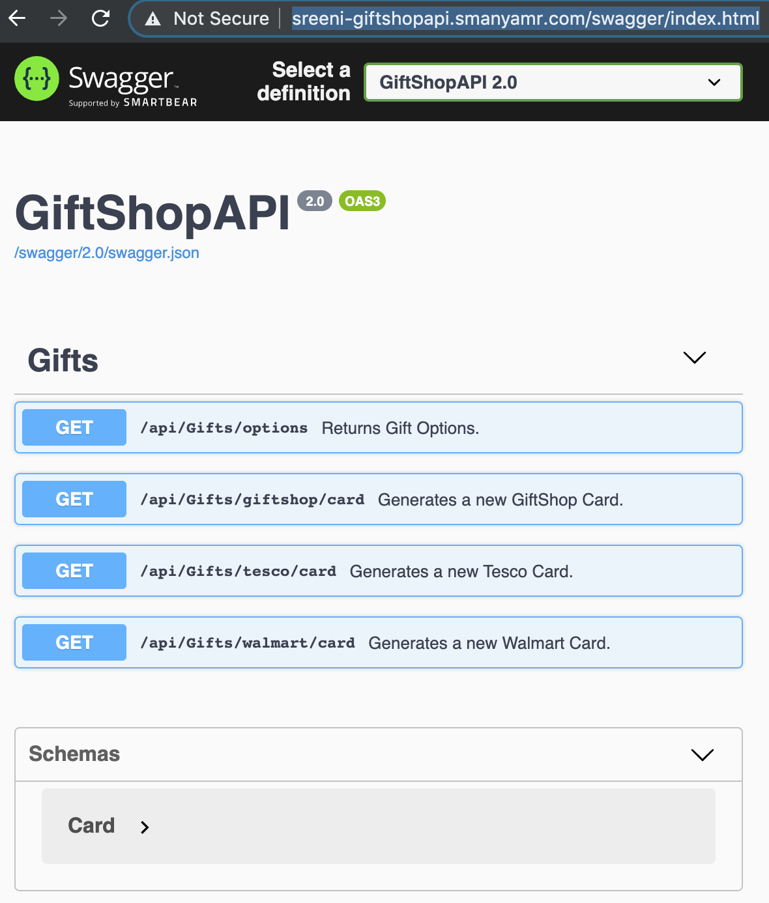
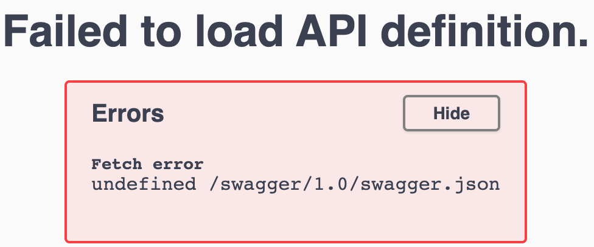
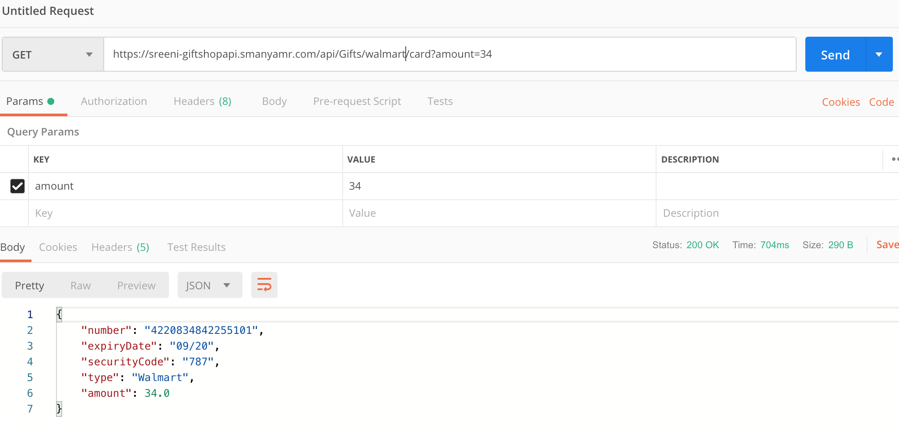
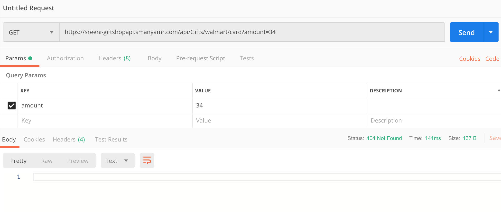
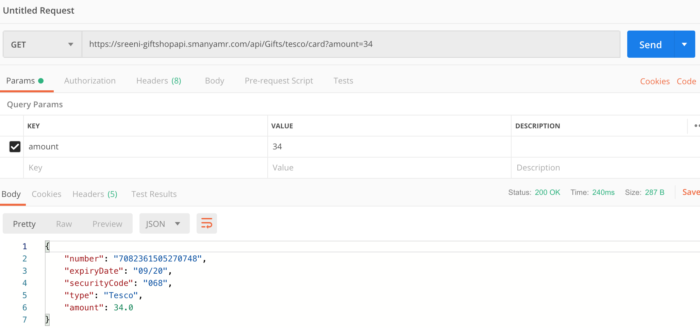
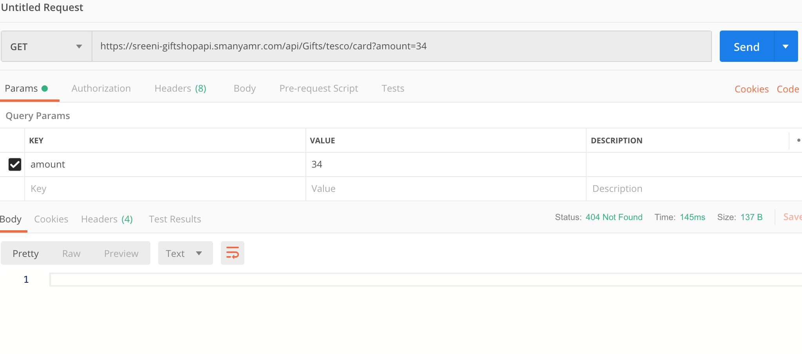

# Lab-12 (Egress - Consuming External Services)

The GiftShop business has grown and customers now expect the option of purchasing partner cards through GiftShop. GiftShop has partnered with Tesco and Walmart to sell their gift cards on the GiftShop website.

As part of this effort GiftShop will integrate with the Tesco and Walmart APIs by consuming those APIs over REST.

### Pre-requisites

1. Publicly accessible Walmart and Tesco APIs. For your convinenece and in the interest of time, I have them readily available  in the below urls

* [Walmart API](https://prognet2019walmartapi.azurewebsites.net)
* [Tesco API](https://prognet2019tescoapi.azurewebsites.net)

2. If you intend to deploy the 3rd Party APIs on your own, you may do so and consume them.

3. Copy the contents from ProgNet2019K8sIstio/Lab-09/GiftShop/Src to ProgNet2019K8sIstio/Lab-12/Begin/GiftShop/Src
4. Copy the contents from ProgNet2019K8sIstio/Lab-10/GiftShop/Istio-Manifests/GiftShop-Ingress.yaml to ProgNet2019K8sIstio/Lab-12/Begin/GiftShop/Istio-Manifests/GiftShop-Ingress.yaml
5. Copy the content from ProgNet2019K8sIstio/Lab-10/GiftShop/K8s-Manifests to ProgNet2019K8sIstio/Lab-12/Begin/GiftShop/K8s-Manifests

## Update GiftShopAPI to consume the Walmart and Tesco APIs

1. The GiftShopAPI will consume Walmart and Tesco API over REST. It requires HttpClient to consume the REST API. Add the HttpClient services to GiftShopAPI in Startup.cs as shown below.

<sub><sup>*Startup.cs --> ProgNet2019K8sIstio/Lab-12/Begin/GiftShop/Src/GiftShopAPI/Startup.cs*</sup></sub>
``` c#
        public void ConfigureServices(IServiceCollection services)
        {
            # Existing code.....

            services.AddHttpClient();
        }
```
2. Replace the code in GiftsController.cs with the below code.

<sub><sup>*GiftsController.cs --> ProgNet2019K8sIstio/Lab-12/Begin/GiftShop/Src/GiftShopAPI/Controllers/GiftsController.cs*</sup></sub>
``` c#
using Microsoft.AspNetCore.Mvc;

using CardsOrg;
using System.Net.Http;
using System.Threading.Tasks;
using System.Collections.Generic;
using Microsoft.Extensions.Configuration;

namespace GiftShopAPI.Controllers
{
    [Route("api/[controller]")]
    [ApiController]
    public class GiftsController : ControllerBase
    {
        private IConfiguration _config;
        private readonly IHttpClientFactory _clientFactory;

        public GiftsController(
            IConfiguration config,
            IHttpClientFactory clientFactory)
        {
            _config = config;
            _clientFactory = clientFactory;
        }

        /// <summary>
        /// Returns Gift Options.
        /// </summary>
        [HttpGet("options")]
        public ActionResult<IEnumerable<string>> GetGiftOptions()
        {
            return new List<string>() { "GiftShop", "Tesco", "Walmart"};
        }

        /// <summary>
        /// Generates a new GiftShop Card.
        /// </summary>
        [HttpGet("giftshop/card")]
        public ActionResult<Card> GetGiftShopCard(double amount)
        {
            if(amount > _config.GetValue<double>("App:BusinessSettings:MaxCardAmount"))
                return UnprocessableEntity($"Gift card amount cannot exceed {_config.GetValue<double>("App:BusinessSettings:MaxCardAmount")}");

            return new CardGenerator().GenerateNew(16, 3, "GiftShop", amount);
        }

        /// <summary>
        /// Generates a new Tesco Card.
        /// </summary>
        [HttpGet("tesco/card")]
        public async Task<ActionResult<Card>> GetTescoCardAsync(double amount)
        {
            if(amount > _config.GetValue<double>("App:BusinessSettings:MaxCardAmount"))
                return UnprocessableEntity($"Gift card amount cannot exceed {_config.GetValue<double>("App:BusinessSettings:MaxCardAmount")}");

            Card card = null;

            var request = new HttpRequestMessage(HttpMethod.Get, 
                $"{_config.GetValue<string>("TescoAPIBaseUrl")}/api/Gifts/card?amount={amount}");
            request.Headers.Add("Accept", "application/json");
            request.Headers.Add("X-API-KEY", _config.GetValue<string>("TescoAPIKey")); // Candidate for Secrets

            var client = _clientFactory.CreateClient();
            var response = await client.SendAsync(request);

            if (response.IsSuccessStatusCode)
            {
                card = await response.Content
                    .ReadAsAsync<Card>();
            }

            return card;
        }

        /// <summary>
        /// Generates a new Walmart Card.
        /// </summary>
        [HttpGet("walmart/card")]
        public async Task<ActionResult<Card>> GetWalmartCardAsync(double amount)
        {
            if(amount > _config.GetValue<double>("App:BusinessSettings:MaxCardAmount"))
                return UnprocessableEntity($"Gift card amount cannot exceed {_config.GetValue<double>("App:BusinessSettings:MaxCardAmount")}");

            Card card = null;

            var request = new HttpRequestMessage(HttpMethod.Get, 
                $"{_config.GetValue<string>("WalmartAPIBaseUrl")}/api/Gifts/card?amount={amount}");
            request.Headers.Add("Accept", "application/json");
            request.Headers.Add("X-API-KEY", _config.GetValue<string>("WalmartAPIKey"));

            var client = _clientFactory.CreateClient();
            var response = await client.SendAsync(request);

            if (response.IsSuccessStatusCode)
            {
                card = await response.Content
                    .ReadAsAsync<Card>();
            }

            return card;
        }
    }
}
```

The above code introduces few important changes.

    a. It injects the HttpClientFactory into the GiftsController constructor
    b. It adds a GetWalmartCardAsync and GetTescoCardAsync mthods to obtain the Walmart and Tesco Cards by invoking te corresponding API

3. Replace the code in appsettings.json with the below code.

<sub><sup>*appsettings.json --> ProgNet2019K8sIstio/Lab-12/Begin/GiftShop/Src/GiftShopAPI/appsettings.json*</sup></sub>
``` json
{
  "App": {
    "Title": "GiftShopAPI",
    "Version": "2.0",
    "BusinessSettings": {
      "MaxCardAmount": 200
    }
  },
  "TescoAPIKey": "GiftShopClient",
  "TescoAPIBaseUrl": "https://prognet2019tescoapi.azurewebsites.net",
  "WalmartAPIKey": "GiftShopClient",
  "WalmartAPIBaseUrl": "https://prognet2019walmartapi.azurewebsites.net",
  "Logging": {
    "LogLevel": {
      "Default": "Warning"
    }
  },
  "AllowedHosts": "*"
}
```

4. Build the docker image for GiftShopAPI 2.0 by executing the command 

``` bash
docker build -f Dockerfile.GiftShopAPI -t <username>-giftshopapi:2.0 .
```

5. Push new version of GiftShopAPI to Harbor by executing the below commands.

``` bash
# Tag the GiftShopAPI image
docker tag <username>-giftshopapi:2.0 <YOUR_HARBOR_FQDN>/<YOUR_HARBOR_PROJECT>/<username>-giftshopapi:2.0
```

``` bash
# Push the GiftShopAPI image
docker push <YOUR_HARBOR_FQDN>/<YOUR_HARBOR_PROJECT>/<username>-giftshopapi:2.0
```

6. Update the GiftShopAPI K8s manifest highlighted below to pull the new image

<sub><sup>*GiftShopAPI.yaml --> ProgNet2019K8sIstio/Lab-12/End/GiftShop/K8s-Manifests/GiftShopAPI.yaml*</sup></sub>
``` yaml
apiVersion: apps/v1beta1
kind: Deployment
metadata:
  name: giftshopapi-v2
spec:
  replicas: 1
  template:
    metadata:
      labels:
        app: giftshopapi
        tier: backend
        version: v2
    spec:
      containers:
      - name: giftshopapi
        image: <YOUR_HARBOR_FQDN>/<YOUR_HARBOR_PROJECT>/<username>-giftshopapi:2.0
```

7. Deploy the new version of GiftShopAPI to K8s using the command

``` bash
kubectl apply -f GiftShopAPI.yaml -n <username>-ns
```

8. Now if you Navigate to https://<username>-giftshopapi.<user's domain>/swagger/index.html in your browser, you would see v1 and v2 of GiftShopAPI alternating.


V1 Swagger


v2 Swagger


By Default Istio routes in round robin fashion. So its split between v1 and v2 50% each.

However if you don't have the developer tools open in Chrome, you may see an error similar to the one below. 



9. If you try to buy Walmart Giftcard using GiftShopAPI via Postman, you may see it returning a Walmart Card and returning null alternating. It returns a Walmart Card when it hits v2 GiftShop API and return a null when it hits v1 GiftShop API. You may see similar behaviour with Tesco Card requests using GiftShopAPI.

Walmart Card returned - hitting v2 GiftShopAPI


Walmart null returned - hitting v1 GiftShopAPI


Tesco Card returned - hitting v2 GiftShopAPI


Tesco null returned - hitting v1 GiftShopAPI


## Route GiftShopAPI outbound via Egress Gateway

1. If you observed, outgoing calls from the GiftShopAPI on Istio Mesh don't fail as outbound traffic is open by default in recent versions. However in older versions of it was closed by default and you had to explicitly open it up for each endpoint using an egress gateway, after defining a Virtual Service corresponding to the Endpoint.

You may restrict outbound access by executing the below command.

``` bash
kubectl get configmap istio -n istio-system -o yaml | sed 's/mode: ALLOW_ANY/mode: REGISTRY_ONLY/g' | kubectl replace -n istio-system -f -
```

It usually takes several minutes for the outbound access to be blocked.

2. You route all your outbound traffic via Egress HTTPS Gateway. This lets you apply rules and control the outbound access. to achive this, you need to define each of your external service as a ServiceEntry. After this you will follow similar pattern as Ingress. You will have to create an Egress Gateway and a VirtualService corresponding to the ServiceEntry. You will have to do this for both WalmartAPI and TescoAPI.

3. Create a file called GiftShop-Egress.yaml in ProgNet2019K8sIstio/Lab-12/End/GiftShop/Istio-Manifests and paste the below ServiceEntry, VirtualService and Gateway defenitions into it.

<sub><sup>*GiftShop-Egress.yaml --> ProgNet2019K8sIstio/Lab-12/End/GiftShop/Istio-Manifests/GiftShop-Egress.yaml*</sup></sub>
``` yaml
apiVersion: networking.istio.io/v1alpha3
kind: Gateway
metadata:
  name: demo-egressgateway
spec:
  selector:
    istio: egressgateway
  servers:
  - port:
      number: 443
      name: https
      protocol: HTTPS
    tls:
      mode: SIMPLE
      serverCertificate: /etc/istio/ingressgateway-certs/tls.crt
      privateKey: /etc/istio/ingressgateway-certs/tls.key
    hosts:
    - prognet2019walmartapi.azurewebsites.net
    - prognet2019tescoapi.azurewebsites.net
---
apiVersion: networking.istio.io/v1alpha3
kind: ServiceEntry
metadata:
  name: walmartapi
spec:
  hosts:
  - prognet2019walmartapi.azurewebsites.net
  ports:
  - number: 443
    name: https
    protocol: HTTPS
  resolution: DNS
  location: MESH_EXTERNAL
---
apiVersion: networking.istio.io/v1alpha3
kind: VirtualService
metadata:
  name: walmartapi
spec:
  hosts:
  - prognet2019walmartapi.azurewebsites.net
  gateways:
  - demo-egressgateway
  tls:
  - match:
    - port: 443
      sni_hosts:
      - prognet2019walmartapi.azurewebsites.net
    route:
    - destination:
        host: prognet2019walmartapi.azurewebsites.net
        port:
          number: 443
      weight: 100
---
apiVersion: networking.istio.io/v1alpha3
kind: ServiceEntry
metadata:
  name: tescoapi
spec:
  hosts:
  - prognet2019tescoapi.azurewebsites.net
  ports:
  - number: 443
    name: https
    protocol: HTTPS
  resolution: DNS
  location: MESH_EXTERNAL
---
apiVersion: networking.istio.io/v1alpha3
kind: VirtualService
metadata:
  name: tescoapi
spec:
  hosts:
  - prognet2019tescoapi.azurewebsites.net
  gateways:
  - demo-egressgateway
  tls:
  - match:
    - port: 443
      sni_hosts:
      - prognet2019tescoapi.azurewebsites.net
    route:
    - destination:
        host: prognet2019tescoapi.azurewebsites.net
        port:
          number: 443
      weight: 100
```

**Note: If you have successfully completed this Lab, contents in your Begin and End folders would match.**