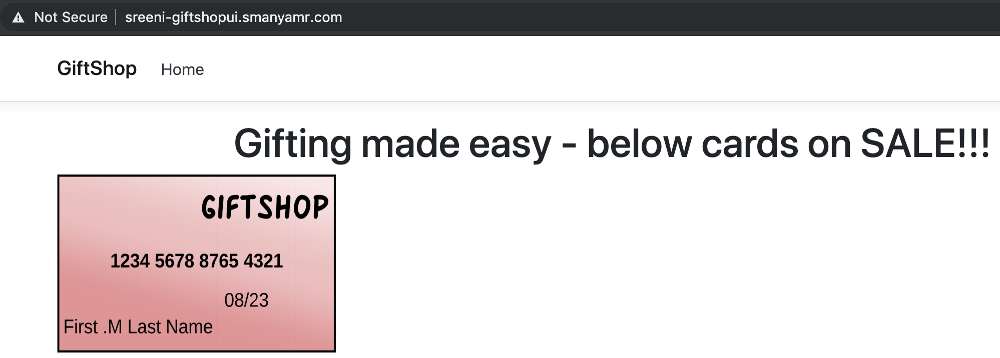
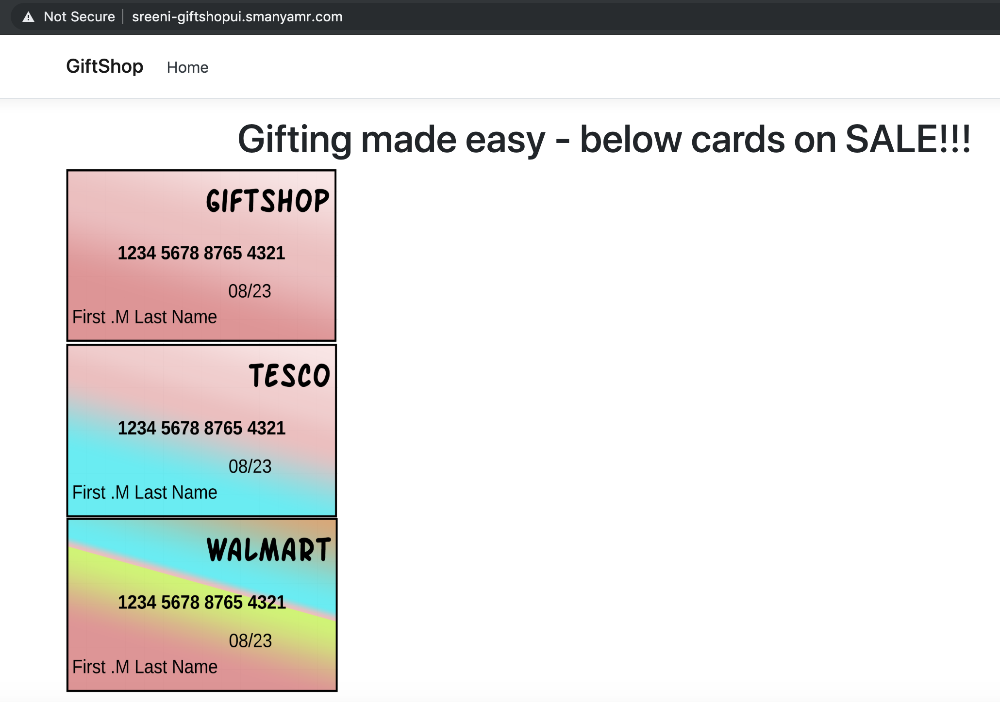

# Lab-13 (Load Balancing Traffic Routing)

We have briefly seen the default Load Balancing from Istio in the last Lab. It does round robin by default. In this Lab we will update the GiftShopUI to leverage the v2(2.0) of GiftShopAPI, so that the end customers can by Walmart and Tesco Gift cards from the UI.

### Pre-requisites

Copy all the contents from ProgNet2019K8sIstio/Lab-12/End to ProgNet2019K8sIstio/Lab-13/Begin

## Update GiftShopUI to consume GiftShopAPI v2

1. Copy Tesco-GiftCard.png and Walmart-GiftCard.png images from ProgNet2019K8sIstio/Lab-13/Assets to ProgNet2019K8sIstio/Lab-13/End/GiftShop/Src/GiftShopUI/wwwroot/images
2. Replace the code in Program.cs with the below code as we want to continue with container env based ConfigMaps for now.

<sub><sup>*Program.cs --> ProgNet2019K8sIstio/Lab-13/End/GiftShop/Src/GiftShopUI/Program.cs*</sup></sub>
``` c#
using System;
using System.Collections.Generic;
using System.IO;
using System.Linq;
using System.Threading.Tasks;
using Microsoft.AspNetCore;
using Microsoft.AspNetCore.Hosting;
using Microsoft.Extensions.Configuration;
using Microsoft.Extensions.Logging;

namespace GiftShopUI
{
    public class Program
    {
        public static void Main(string[] args)
        {
            CreateWebHostBuilder(args).Build().Run();
        }

        public static IWebHostBuilder CreateWebHostBuilder(string[] args) =>
            WebHost.CreateDefaultBuilder(args)
                .UseStartup<Startup>();
    }
}
```

3. Ensure that we have the container env based config map in the K8s cluster by executing the below command.

``` bash
kubectl apply -f GiftShopUI-ConfigEnv.yaml -n <username>-ns
```

**Note: Changes to Config are not reloaded automatically. So you may have to restart your pods if required.**

4. Modify GiftOptions to include Walmart and Tesco options as shown below.

<sub><sup>*GiftOptions.cs --> ProgNet2019K8sIstio/Lab-13/End/GiftShop/Src/GiftShopUI/Models/GiftOptions.cs*</sup></sub>
``` c#
public enum GiftOptions
{
    GiftShop = 1, 
    Tesco = 2, 
    Walmart = 3
}
```

5. Update the Index.cshtml to include the Walmart and Tesco options in the dropdown

``` html
    <div>
        <a href="/Home/Gifts">
            
        </a>
    </div>
    <div>
        <a href="/Home/Gifts">
            
        </a>
    </div>
```

6. Build the docker image for GiftShopUI 6.0 by executing the command 

``` bash
docker build -f Dockerfile.GiftShopUI -t <username>-giftshopui:6.0 .
```

7. Push new version of GiftShopUI to Harbor by executing the below commands.

``` bash
# Tag the GiftShopUI image
docker tag <username>-giftshopui:6.0 <YOUR_HARBOR_FQDN>/<YOUR_HARBOR_PROJECT>/<username>-giftshopui:6.0
```

``` bash
# Push the GiftShopUI image
docker push <YOUR_HARBOR_FQDN>/<YOUR_HARBOR_PROJECT>/<username>-giftshopui:6.0
```

8. Update the GiftShopUI K8s manifest highlighted below to pull the new image

<sub><sup>*GiftShopUI.yaml --> ProgNet2019K8sIstio/Lab-13/End/GiftShop/K8s-Manifests/GiftShopUI.yaml*</sup></sub>
``` yaml
apiVersion: apps/v1beta1
kind: Deployment
metadata:
  name: giftshopui-v6
spec:
  replicas: 1
  template:
    metadata:
      labels:
        app: giftshopui
        tier: frontend
        version: v6
    spec:
      containers:
      - name: giftshopui
        image: <YOUR_HARBOR_FQDN>/<YOUR_HARBOR_PROJECT>/<username>-giftshopui:6.0
```

9. Deploy the new version of GiftShopUI to K8s using the command

``` bash
kubectl apply -f GiftShopUI.yaml -n <username>-ns
```

10. Take a look at the deployments you currently have running, by executing 

``` bash
kubectl get deployments -n <username>-ns

NAME             READY   UP-TO-DATE   AVAILABLE   AGE
giftshopapi-v1   1/1     1            1           2d8h
giftshopapi-v2   1/1     1            1           99m
giftshopui-v4    1/1     1            1           16h
giftshopui-v5    1/1     1            1           26h
giftshopui-v6    1/1     1            1           7m43s
```

You are most likely to see the above results.

Delete all deployments other than giftshopapi-v2, giftshopui-v4 and giftshopui-v6 by using the below commands.

``` bash
delete deployment giftshopapi-v1 -n <username>-ns

delete deployment giftshopui-v5 -n <username>-ns
```

11. Now if you Navigate to https://<username>-giftshopui.<user's domain>/ in your browser, you would see v4 and v6 of GiftShopUI alternating due to round robin nature of Istio

GiftShopUI v4


GiftShopUI v6


12. Lets us assume business decides to expose v4 to "continent=asia" and v6 to rest of the world. Then you may update the GiftShop-Ingress as shown below to achieve that routing.

<sub><sup>*GiftShop-Ingress.yaml --> ProgNet2019K8sIstio/Lab-13/End/GiftShop/Istio-Manifests/GiftShop-Ingress.yaml*</sup></sub>
``` yaml
apiVersion: networking.istio.io/v1alpha3
kind: VirtualService
metadata:
  name: <username>-giftshopui
spec:
  hosts:
  - <username>-giftshopui.<user's domain>
  gateways:
  - demo-ingress-gateway
  http:
  - match:
    - headers:
        continent:
          exact: asia
    route:
    - destination:
        host: giftshopui
        subset: v4
  - route:
    - destination:
        host: giftshopui
        subset: v6
```