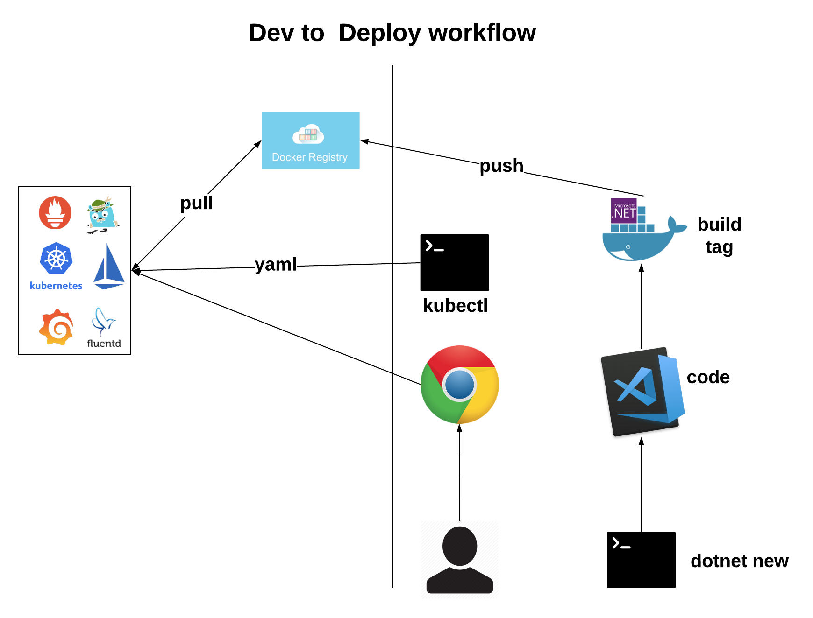

# Deploy and Run a Distributed Cloud Native system using Istio, Kubernetes & .NET core

## Goal

1. Build a fictitious .Net Core Microservices application
2. Create Docker images
3. Deploy the images to a container registry
4. Deploy Kubernetes services 
5. Deploy Istio services 

You will explore many of the complexities such as 
Service Discovery, 
Externalization of Configuration, 
Load balancing, 
Circuit Breaker, 
Canary updates, 
Distributed Tracing, 
Monitoring etc, 
all with guided samples.

## Labs structure and working through it

The session has been organized into multiple labs some of which has a _**Begin**_ and a _**End**_ folder. 

1. Lab-01 (Creating a basic GiftShop .Net core Application)
2. Lab-02 (Containerize GiftShop Application using Docker locally)
3. Lab-03 (Tag and Push GiftShop Application to Harbor Container Registry)
4. Lab-04 (Creating / Connecting to PKS K8s cluster)
5. Lab-05 (Install Istio on PKS K8s cluster)
6. Lab-06 (Deploying GiftShop Application to Pivotal Kubernetes Service)
7. Lab-07 (Enable Istio and Expose GiftShop on Http)
8. Lab-08 (Service Discovery using Istio)
9. Lab-09 (Externalize Config using ConfigMaps)
10. Lab-10 (Enable Https Ingress)
11. Lab-11 (Create 3rd party API and deploy to Azure)
12. Lab-12 (Demonstrate Egress)
13. Lab-13 (Load Balancing Traffic Routing)